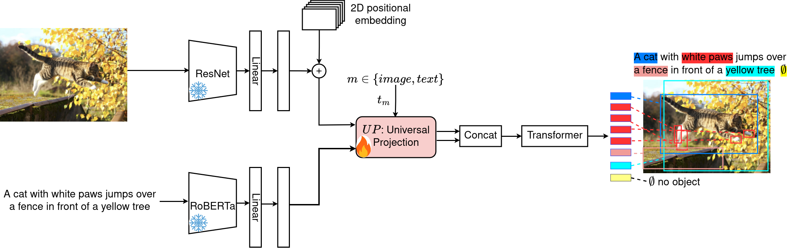
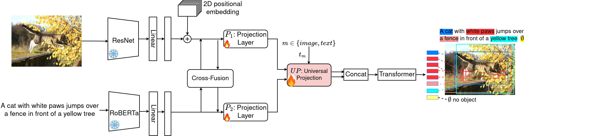
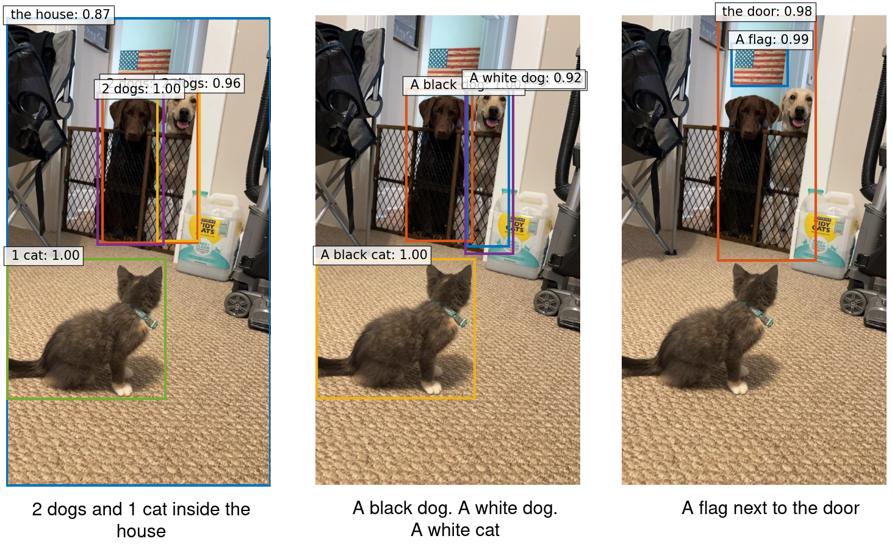

A Lightweight Modular Framework for Low-Cost Open-Vocabulary Object Detection Training
========

Object detection is a core task in computer vision, crucial for applications like robotics, image analysis, and autonomous vehicles. While existing methods like MDETR (Multimodal Detr) have pushed the boundaries of open-vocabulary object detection by combining vision and language pre-training, they often suffer from high computational costs due to large models and extensive training requirements.

To tackle this, we present **LightMDETR**, a lightweight framework designed to optimize MDETR by significantly reducing the number of parameters while maintaining—or even enhancing—performance. Instead of training both the vision and language models simultaneously, we freeze the MDETR backbone and train only a Universal Projection (UP) module, which aligns vision and language features efficiently. This approach is further streamlined with a learnable modality token that facilitates smooth switching between modalities.

LightMDETR demonstrates its efficiency on tasks like phrase grounding, referring expression comprehension, and segmentation, delivering superior performance with reduced computational costs compared to state-of-the-art methods.

--- 

For details in MDETR model, please see the paper: [MDETR - Modulated Detection for End-to-End Multi-Modal Understanding](https://arxiv.org/abs/2104.12763) by Aishwarya Kamath, Mannat Singh, Yann LeCun, Ishan Misra, Gabriel Synnaeve and Nicolas Carion.

# Models
We propose two models: LightMDETR and LightMDETR-Plus.

<center><b>Model 1: LightMDETR</b></center><br>



<center><b>Model 2: LightMDETR-Plus</b></center><br>




# Usage
The `requirements.txt` file contains all the dependencies necessary for running LightMDETR, with a few modifications tailored specifically for optimizing MDETR.
We provide instructions how to install dependencies via conda.

First, clone the repository locally:
```
git clone https://github.com/b-faye/lightmdetr
```

Make a new conda env and activate it: 
```
conda create -n lightmdetr_env python=3.11
conda activate lightmdetr_env
```

Install the the packages in the requirements.txt:
```
pip install -r requirements.txt
```

Multinode training

Distributed training is available via Slurm and [submitit](https://github.com/facebookincubator/submitit):
```
pip install submitit
```


# Instructions

1. Ensure you're using `transformers==4.30.0`.

2. Run the training script with `main.py` instead of `run_*` (other scripts may not work).

3. Modify `util/dist.py` to ensure the device name is correctly recognized during training.

4. In `main.py`, comment out the line `torch.set_deterministic(True)` to prevent potential issues with reproducibility settings.

5. Update the following line in the `pycocotools` library:
   - In the file `lightweight_mdetr-env/lib/python3.11/site-packages/pycocotools/cocoeval.py`, at line 378, change `np.float` to `np.float32` to avoid deprecated data type warnings:
   ```python
   tp_sum = np.cumsum(tps, axis=1).astype(dtype=np.float32)
   ```
6. To use LightMDETR-Plus, replace `models/transformer.py` with the file `models/transformer_plus.py`.


# Pre-training
For pre-training, we use the same dataset as MDETR. You can find the data links, preparation steps, and the script for running fine-tuning in the [Pretraining Instructions](.github/pretrain.md).


# Downstream tasks
At first, download the pre-trained [Resnet101](https://zenodo.org/record/4721981/files/pretrained_resnet101_checkpoint.pth?download=1) 


## Phrase grounding on Flickr30k
Instructions for data preparation and script to run evaluation can be found at [Flickr30k Instructions](.github/flickr.md)

```bash
python -m torch.distributed.launch --nproc_per_node=2 --use_env main.py --dataset_config configs/flickr.json --resume https://zenodo.org/record/4721981/files/flickr_merged_res

```

| Method         | R@1  (Val) | R@5  (Val) | R@10 (Val) | R@1  (Test) | R@5  (Test) | R@10 (Test) |
|----------------|------------|------------|------------|-------------|-------------|-------------|
| MDETR          | 82.5       | 92.9       | **94.9**   | 83.4        | 93.5        | **95.3**    |
| LightMDETR     | 83.98      | 93.15      | 94.20      | **83.87**   | 94.10       | 95.17       |
| LightMDETR-Plus| **84.02**  | **93.56**  | 94.9       | 83.80       | **94.66**   | 95.23       |


## Referring expression comprehension on RefCOCO, RefCOCO+, RefCOCOg
Instructions for data preparation and script to run finetuning and evaluation can be found at [Referring Expression Instructions](.github/refexp.md)

| Method          | P@1 (RefCOCO) | P@5 (RefCOCO) | P@10 (RefCOCO) | P@1 (RefCOCO+) | P@5 (RefCOCO+) | P@10 (RefCOCO+) | P@1 (RefCOCOg) | P@5 (RefCOCOg) | P@10 (RefCOCOg) |
|-----------------|---------------|---------------|----------------|----------------|----------------|----------------|----------------|----------------|-----------------|
| MDETR           | 85.90         | 95.41         | 96.67          | **79.44**       | **93.95**       | **95.51**       | 80.88          | 94.19          | 95.97           |
| LightMDETR      | **85.92**     | 95.48         | **96.76**      | 79.24           | 93.83           | 95.26           | **80.97**      | **94.87**      | 96.30           |
| LightMDETR-Plus | 85.37         | **95.52**     | 96.73          | 77.98           | 93.85           | 95.47           | 80.24          | 94.26          | **96.56**       |

<center>Table: Precision performance comparison between our proposed models, LightMDETR and LightMDETR-Plus, and MDETR in the referring expression comprehension task on the RefCOCO, RefCOCO+, and RefCOCOg datasets.</center>


### RefCOCO 

```bash
python -m torch.distributed.launch --nproc_per_node=2 --master_port=29500 --use_env main.py --output-dir RefCOCO --dataset_config configs/refcoco.json --batch_size 4 --load pretrained_resnet101_checkpoint.pth --ema --text_encoder_lr 1e-5 --lr 5e-5

```
### RefCOCO+

```bash
python -m torch.distributed.launch --nproc_per_node=2 --master_port=29500 --use_env main.py --output-dir RefCOCO --dataset_config configs/refcoco+.json --batch_size 4 --load pretrained_resnet101_checkpoint.pth --ema --text_encoder_lr 1e-5 --lr 5e-5

```
### RefCOCOg
```bash
python -m torch.distributed.launch --nproc_per_node=2 --master_port=29500 --use_env main.py --output-dir RefCOCO --dataset_config configs/refcocog.json --batch_size 4 --load pretrained_resnet101_checkpoint.pth --ema --text_encoder_lr 1e-5 --lr 5e-5

```

## Referring expression segmentation on PhraseCut
Instructions for data preparation and script to run finetuning and evaluation can be found at [PhraseCut Instructions](.github/phrasecut.md)

```bash
python -m torch.distributed.launch --nproc_per_node=2 --use_env main.py --dataset_config configs/phrasecut.json --output-dir PhraseCut --epochs 10 --lr_drop 11 --load pretrained_resnet101_checkpoint.pth --ema --text_encoder_lr 1e-5 --lr 5e-5
```

| Method          | M-IoU | Pr@0.5 | Pr@0.7 | Pr@0.9 |
|-----------------|-------|--------|--------|--------|
| MDETR           | 53.1  | 56.1   | 38.9   | 11.9   |
| LightMDETR      | 53.45 | 56.98  | 39.12  | 11.6   |
| LightMDETR-Plus | **53.87** | **57.07** | **39.27** | **11.82** |

<center>Table: Validation of Referring Expression Segmentation using the mean intersection-over-union (M-IoU) between predicted and ground-truth masks, alongside precision Pr@$I$, where success is defined as the predicted mask achieving an IoU with the ground-truth that exceeds the threshold I.</center>

# Demo


